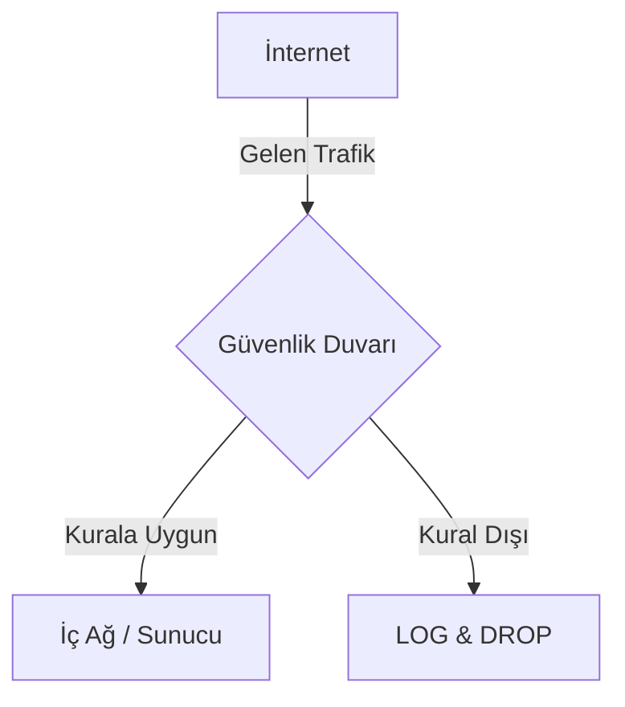
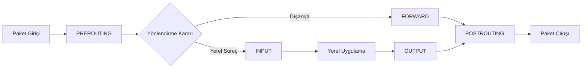
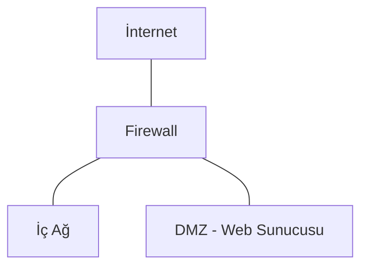

# 🛡️ Firewall Fundamentals Lab

[](https://github.com/arch-yunus/Firewall-Fundamentals-Lab)
[](https://opensource.org/licenses/MIT)
[](http://makeapullrequest.com)

Bu depo, ağ güvenliğinin temel taşı olan **Güvenlik Duvarı (Firewall)** teknolojilerini, çalışma prensiplerini ve yapılandırma türlerini öğrenmek/öğretmek amacıyla oluşturulmuş kapsamlı bir eğitim rehberidir.

---

## 📑 İçindekiler
* [Güvenlik Duvarı Nedir?](#güvenlik-duvarı-nedir)
* [Çalışma Prensipleri](#çalışma-prensipleri)
* [Güvenlik Duvarı Türleri](#güvenlik-duvarı-türleri)
* [Modern Teknolojiler (NGFW & WAF)](#modern-teknolojiler)
* [OSI Modeli ve Firewall Katmanları](#osi-modeli-ve-firewall-katmanları)
* [Iptables Derin Dalış (Tablolar & Zincirler)](#iptables-derin-dalış)
* [Stateful vs. Stateless Filtering](#stateful-vs-stateless-filtering)
* [Pratik Senaryolar & Iptables](#pratik-senaryolar)
* [Lab: Uygulamalı Senaryo (Host-Based)](#lab-uygulamalı-senaryo)
* [Lab: Docker Ortamı (Network-Based)](#lab-docker-ortamı)
* [İleri Seviye Konseptler (NAT & DOS)](#i̇leri-seviye-konseptler)
* [Modern Alternatif: NFTables](#modern-alternatif-nftables)
* [Ağ Mimarileri ve Güvenlik Duvarı](#ağ-mimarileri-ve-güvenlik-duvarı)
* [En İyi Uygulamalar (Best Practices)](#en-i̇yi-uygulamalar)

---

## 🔍 Güvenlik Duvarı Nedir?

Güvenlik duvarı, önceden belirlenmiş güvenlik kurallarına dayanarak gelen ve giden ağ trafiğini izleyen ve kontrol eden bir ağ güvenlik sistemidir. Temel amacı, güvenilir bir iç ağ ile güvenilmeyen bir dış ağ (İnternet gibi) arasında bir engel oluşturmaktır.

### Trafik Akış Diyagramı


---

## 🛠️ Güvenlik Duvarı Türleri

| Tür | Açıklama | Odak Noktası |
| :--- | :--- | :--- |
| **Host-Based** | Sadece yüklü olduğu cihazın trafiğinden sorumludur. | Uç Nokta Güvenliği |
| **Network-Based** | Tüm ağ trafiğini süzmek için ağın girişine konumlandırılır. | Ağ Geneli Güvenlik |
| **WAF (Web Application Firewall)** | L7 (Uygulama) katmanında SQLi, XSS gibi saldırıları engeller. | Web Uygulamaları |
| **NGFW (Next-Gen Firewall)** | DPI, IPS ve Uygulama Farkındalığı içeren modern çözümlerdir. | Gelişmiş Tehdit Kontrolü |

---

## 🌐 OSI Modeli ve Firewall Katmanları

Güvenlik duvarları, OSI modelinin farklı katmanlarında veri paketlerini inceleyerek karar verirler.

| OSI Katmanı | Firewall Türü | İnceleme Birimi | Örnek |
| :--- | :--- | :--- | :--- |
| **L3 (Ağ)** | Packet Filter | IP Başlığı | Kaynak/Hedef IP Engelleme |
| **L4 (Taşıma)** | Circuit-Level | TCP/UDP Portu | Port 80 Erişimi |
| **L7 (Uygulama)** | WAF / NGFW | Veri İçeriği | SQL Injection Engelleme |

---

## 🧩 Iptables Derin Dalış

Iptables, paketleri yönetmek için **Tablolar (Tables)** ve **Zincirler (Chains)** kullanır.

### Tablolar
1.  **Filter:** Varsayılan tablo. Paketlerin geçişine karar verir.
2.  **NAT:** IP/Port çevrimi işlemleri için kullanılır.
3.  **Mangle:** Paket başlıklarını değiştirmek (TTL, TOS vb.) içindir.

### Bir Paketin Yaşam Döngüsü


---

## ⚡ Stateful vs. Stateless Filtering

Modern güvenlik duvarları genellikle **Stateful (Durumsal)** yapıdadır.

- **Stateless (Durumsuz):** Her paketi bağımsız inceler. Bağlantının bağlamını bilmez. Hızlıdır ancak esnek değildir.
- **Stateful (Durumsal):** `conntrack` modülünü kullanarak bağlantıların durumunu (NEW, ESTABLISHED, RELATED) takip eder. Bir talebe verilen cevabın otomatik geçmesine izin verir.

---

## 🚀 Temel Komutlar ve Konfigürasyonlar

### Linux Iptables (Temel Yapı)
`iptables`, Linux çekirdeği tarafından sağlanan bir güvenlik duvarı tablosu yönetim aracıdır.

- **Tüm kuralları temizle:**
  ```bash
  sudo iptables -F
  ```
- **Mevcut kuralları listele:**
  ```bash
  sudo iptables -L -n -v --line-numbers
  ```
- **Poliçeleri belirle (Hepsini reddet):**
  ```bash
  sudo iptables -P INPUT DROP
  sudo iptables -P FORWARD DROP
  sudo iptables -P OUTPUT ACCEPT
  ```

---

## 🔥 Lab: Uygulamalı Senaryo (Host-Based)

### Senaryo: Web Sunucusu Güvenliği
Bir web sunucumuz var ve sadece HTTP (80), HTTPS (443) ve SSH (22) bağlantılarına izin vermek istiyoruz. Diğer her şeyi engelleyeceğiz.

#### Adım 1: SSH Erişimi Ver (Bağlantınızın Kesilmemesi İçin!)
```bash
sudo iptables -A INPUT -p tcp --dport 22 -j ACCEPT
```

#### Adım 2: Web Trafiğine İzin Ver (80 & 443)
```bash
sudo iptables -A INPUT -p tcp --dport 80 -j ACCEPT
sudo iptables -A INPUT -p tcp --dport 443 -j ACCEPT
```

#### Adım 3: Mevcut Bağlantıları Koru
```bash
sudo iptables -A INPUT -m conntrack --ctstate ESTABLISHED,RELATED -j ACCEPT
```

#### Adım 4: Geri Kalan Her Şeyi Engelle
```bash
sudo iptables -P INPUT DROP
```

> [!IMPORTANT]  
> `iptables` kuralları sistem yeniden başlatıldığında silinir. Kalıcı hale getirmek için `iptables-persistent` kullanmalısınız.

---

## 🐳 Lab: Docker Ortamı (Network-Based)

Daha gelişmiş ve izole bir test ortamı için Docker Compose topolojisini kullanabilirsiniz. Bu ortam; bir istemci, bir güvenlik duvarı ve bir hedef sunucudan oluşur.

### Topoloji
- **Client (10.0.2.10):** Dış ağdaki istemci.
- **Firewall (10.0.2.1 / 10.0.1.1):** Geçit (Gateway).
- **Server (10.0.1.10):** İç ağdaki hedef web sunucusu.

### Başlatma ve Yönetim
Lab ortamını yönetmek için kök dizindeki `lab/labctl.sh` aracını kullanın:

```bash
cd lab
chmod +x labctl.sh

./labctl.sh up      # Lab'ı başlat
./labctl.sh test    # Testleri çalıştır
./labctl.sh status  # Durumu kontrol et
./labctl.sh apply nat  # NAT senaryosunu uygula
```

---

## 🛰️ İleri Seviye Konseptler (NAT & DOS)

Lab ortamındaki `lab/advanced` dizininde bulunan betikler ile daha karmaşık senaryoları test edebilirsiniz.

### NAT (Network Address Translation)
İç ağdaki cihazların dış dünyaya erişimini sağlar. 
- **Setup:** `bash lab/advanced/nat_setup.sh`

### DOS Koruması (Rate Limiting)
Belirli bir IP'den gelen paket sayısını sınırlayarak basit saldırıları engeller.
- **Setup:** `bash lab/advanced/dos_protection.sh`

---

## 🛠️ Modern Alternatif: NFTables

`iptables` yerini alan `nftables`, daha performanslı ve temiz bir sözdizimi sunar. 

### Iptables vs. NFTables Karşılaştırması

| Özellik | Iptables | NFTables |
| :--- | :--- | :--- |
| **Sözdizimi** | Sabit / Karmaşık | Esnek / Hiyerarşik |
| **Performans** | Orta (Zincir tabanlı) | Yüksek (VM tabanlı) |
| **Güncelleme** | Atomik değil | Tam atomik kural güncellemeleri |

**NFTables Örnek Kurallar:** `lab/nftables/rules.nft`

---

## 🧪 Otomatik Doğrulama

Kurallarınızın doğru çalışıp çalışmadığını test etmek için merkezi aracı kullanın:
```bash
cd lab
./labctl.sh test
```

---

## 🏗️ Ağ Mimarileri ve Güvenlik Duvarı

Güvenlik duvarının ağdaki konumu, güvenlik seviyesini doğrudan etkiler.

1.  **Perimeter (Çevre) Firewall:** İç ağ ile dış dünyayı ayıran ana kapı.
2.  **Internal Firewall:** İç ağdaki farklı departmanları (örn: İK ve AR-GE) izole etmek için kullanılır.
3.  **DMZ (Demilitarized Zone):** Web sunucusu gibi dışa açık servislerin, iç ağdan izole edildiği "tampon bölge".



---

## 🛡️ En İyi Uygulamalar (Best Practices)

1.  **Varsayılan Politika REDDET (DROP):** Her şeye izin verip bazılarını yasaklamak yerine, her şeyi yasaklayıp sadece gerekli olanlara izin verin.
2.  **En Az Yetki Prensibi:** Bir kullanıcıya veya servise sadece ihtiyacı olan portları açın.
3.  **Kural Sıralamasına Dikkat:** Kurallar yukarıdan aşağıya işlenir. En spesifik kuralları en üste, genel kuralları en alta koyun.
4.  **Loglama:** Kritik paketleri (`-j LOG`) kaydedin ancak storage doluluğunu önlemek için hız sınırlaması kullanın.

---

## 🤝 Katkıda Bulunma
Bu proje eğitim amaçlıdır. Yeni senaryolar veya yapılandırma örnekleri eklemek isterseniz lütfen bir **Pull Request** açın!

1. Depoyu forklayın.
2. Yeni özellik dalı (branch) oluşturun.
3. Değişikliklerinizi commit edin.
4. Pull Request oluşturun.

---

## 📝 Lisans
Bu proje [MIT Lisansı](LICENSE) altında lisanslanmıştır.
